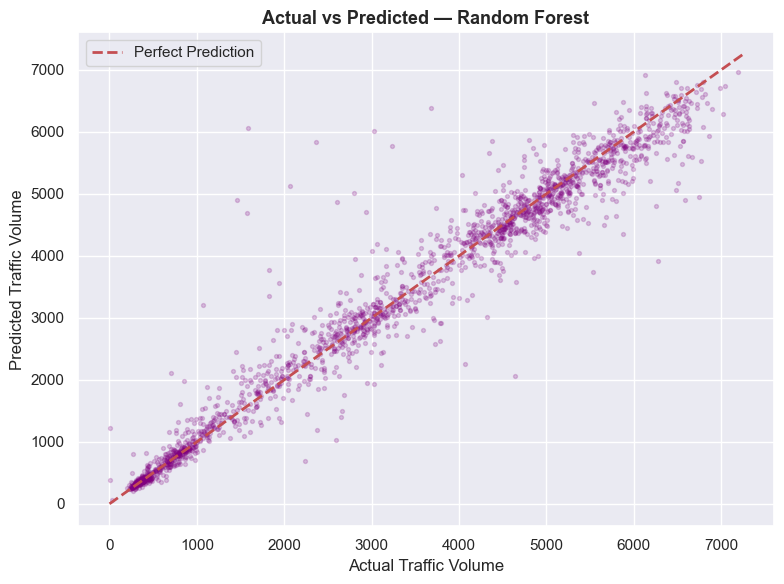

# City Traffic Flow Analysis: Urban Analytics Project

## Project Overview
This project analyzes real-world traffic volume data to identify congestion patterns, peak hours, and the impact of external factors such as weather and calendar events. The goal is to provide actionable insights for city planners to optimize infrastructure and reduce transit delays.

## Team Roles & Workflow
The work was divided among a three-person team to cover the full data science lifecycle:
1. **Data Engineering:** Sourcing, cleaning, and feature engineering (handling nulls, datetime extraction).
2. **Analysis & Visualization:** Statistical EDA, correlation analysis, and generating visual deliverables.
3. **Strategic Reporting:** Translating data findings into 3 actionable urban planning recommendations.

## Deliverables
- **01 Cleaned Dataset:** Documentation of the preprocessing steps taken on the Metro Interstate Traffic Volume dataset.
- **02 Temporal Trends:** Peak hour bar charts and day-of-week heatmaps.
- **03 Weather Impact:** Scatter plots correlating precipitation and temperature with traffic density.
- **04 Traffic Insight Report:** A professional summary for urban decision-makers.

## Technical Results
Our predictive model (Random Forest Regressor) achieved an **R² score of 0.95** on the Minneapolis-St Paul (I-94) dataset.

### Model Performance
Below is the parity plot showing Actual vs. Predicted Traffic Volume:

## Project Requirements
The project follows the specific guidelines outlined in the brief:

## Dataset Sources
* **US Data:** [Kaggle — Metro Interstate Traffic Volume](https://www.kaggle.com/datasets/anshtanwar/metro-interstate-traffic-volume)
* **UK Data:** [UK Dept. of Transport Road Traffic Statistics](https://roadtraffic.dft.gov.uk/downloads)

## Tools Used
- **Language:** Python
- **Libraries:** Pandas, Seaborn, Matplotlib, Scikit-Learn
- **Environment:** Jupyter Notebook
